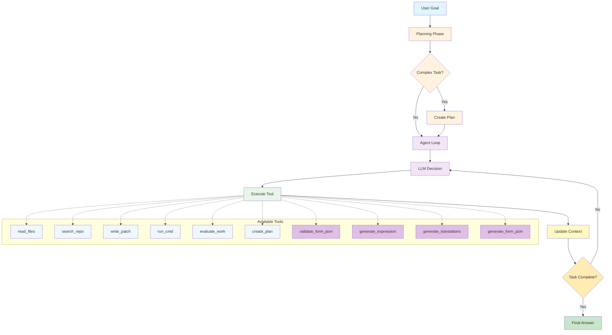
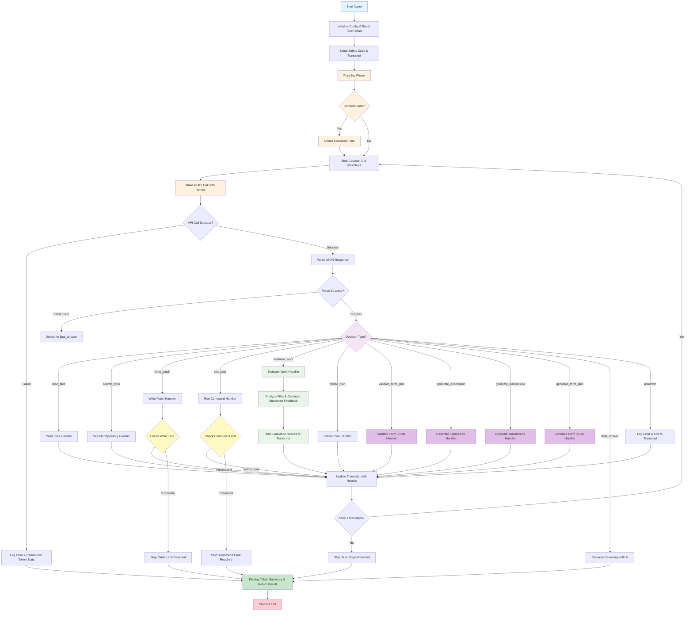

# Agent Loop - Coding Agent

## Overview

This project is a simple coding agent implemented with an Agent Loop architecture.

It runs AI LLM calls in a loop using Vercel's AI SDK v5 and depending on the response, it can read files, search the repo, write patches, run commands, and evaluate work quality. The agent continues this loop until it reaches a final answer or a maximum number of iterations.

It has OpenTelemetry-based observability for tracing using Jaeger.

## Supported AI Providers

The agent supports multiple AI providers through Vercel's AI SDK v5:

- **OpenAI** (GPT-5-mini, GPT-5, etc.)
- **Anthropic** (Claude Sonnet 4.5, etc.)
- **Google** (Gemini 2.5 Flash, etc.)
- **Ollama** (Local models like Granite4, etc.)

You can switch between providers using the `--provider` CLI option or by setting the appropriate environment variables.

## Key Features

- **Planning Phase**: Automatically analyzes project structure at startup and creates execution plans for complex tasks
- **Manual Tool Calls**: Uses manual tool calls instead of OpenAI function calling for more control
- **Full-File Patches**: Uses full-file format for all file modifications (complete file content replacement)
- **Work Evaluation**: Built-in evaluation tool that analyzes created files and provides structured feedback with scores, strengths, improvements, and specific suggestions
- **Iterative Workflow**: Agent follows a structured workflow: create → evaluate → improve with full-file patches → re-evaluate
- **Multi-Provider Support**: Seamlessly switch between OpenAI, Anthropic, Google, and Ollama providers
- **Observability**: OpenTelemetry-based tracing with Jaeger integration for monitoring agent execution and debugging

## Tools Available

1. **read_files**: Read and analyze existing files
2. **search_repo**: Search the repository for patterns or content
3. **write_patch**: Apply patches using full-file format (complete file content replacement)
4. **run_cmd**: Execute shell commands
5. **evaluate_work**: Analyze files and provide structured feedback for improvements
6. **create_plan**: Create a structured execution plan for complex tasks
7. **validate_form_json**: Validate JSON against form schema
8. **generate_expression**: Generate expression for form field
9. **generate_translations**: Generate translations for form
10. **generate_form_json**: Generate complete form JSON (main form generation action)
11. **final_answer**: Complete the task and generate a summary

## High-Level Agent Loop



## Detailed Architecture Diagram



## CLI Usage

### Installation

Install globally to use from anywhere on your system:

**Option 1: Using the install-global script (recommended)**

```bash
npm run install-global
```

This will build the project and install it globally in one step.

**Option 2: Manual installation**

```bash
npm install -g .
```

If you need extra permissions, then:

```bash
chmod +x <path>/form-agent/dist/src/cli.js
```

**Option 3: Use directly without installation**

```bash
npx form-agent
```

### Basic Usage

Run the CLI in interactive mode:

```bash
form-agent
```

Or provide a prompt directly:

```bash
form-agent --prompt "Create a simple HTML page with CSS styling"
```

### CLI Options

```bash
form-agent [options]

Options:
  -p, --prompt <prompt>           Direct prompt to execute (skips interactive mode)
  -m, --max-steps <number>        Maximum number of steps to execute (default: 20)
  -w, --max-writes <number>       Maximum number of file writes (default: 10)
  -c, --max-commands <number>     Maximum number of commands to run (default: 20)
  --provider <provider>           AI provider to use (openai, anthropic, google) (default: openai)
  --model <model>                 Specific model to use (optional)
  --no-console-log                Disable console logging
  --file-log                      Enable file logging
  --log-file <path>               Log file path (default: agent-log.txt)
  --test-command <command>        Test command to run (default: npm test --silent)
  --test-args <args>              Test command arguments (comma-separated)
  -h, --help                      Display help for command
  -V, --version                   Display version number
```

### Examples

```bash
# Interactive mode
form-agent

# Direct prompt
form-agent --prompt "Create a React component for a todo list"

# With custom limits
form-agent --prompt "Build a calculator app" --max-steps 30 --max-writes 15

# With custom test command
form-agent --prompt "Create a Node.js API" --test-command "npm" --test-args "test,run"

# With file logging
form-agent --prompt "Create a website" --file-log --log-file my-agent.log

# Using different AI providers
form-agent --prompt "Create a React app" --provider anthropic
form-agent --prompt "Build a Python API" --provider google --model gemini-1.5-pro
form-agent --prompt "Write TypeScript types" --provider openai --model gpt-4
form-agent --prompt "Create a simple script" --provider ollama --model granite4:tiny-h
```

## Environment Variables:

### AI Provider API Keys (choose one):
- `OPENAI_API_KEY` : Your OpenAI API key
- `ANTHROPIC_API_KEY` : Your Anthropic API key  
- `GOOGLE_API_KEY` : Your Google API key
- `OLLAMA_BASE_URL` or `OLLAMA_HOST` : Ollama server URL (optional, defaults to localhost:11434)

### Agent Configuration:
- `AGENT_CONSOLE_LOGGING=false` : Disable console logging (default: true)
- `AGENT_FILE_LOGGING=true` : Enable file logging (default: false)
- `AGENT_LOG_FILE=path/to/log` : Log file path (default: agent-log.txt)

### Observability (Optional, Jaeger-ready):
- `JAEGER_OBS_ENABLED=true` : Enable OpenTelemetry-based observability (default: disabled)
- `SERVICE_NAME=form-agent` : Service name for traces
- `JAEGER_OTLP_TRACES_URL=http://localhost:4318/v1/traces` : OTLP HTTP traces endpoint (default: http://localhost:4318/v1/traces)
- `JAEGER_ENDPOINT` : Alternative to JAEGER_OTLP_TRACES_URL (will be converted to OTLP format)

**Note**: Metrics are currently disabled. Only traces are exported to Jaeger using OTLP (OpenTelemetry Protocol).

Notes:
- **Jaeger Setup**: To use Jaeger, ensure it's running locally. You can start it with:
  ```bash
  docker run -d --name jaeger -p 16686:16686 -p 4318:4318 jaegertracing/all-in-one:latest
  ```
- **Jaeger UI**: Access the Jaeger UI at `http://localhost:16686` to view traces.
- **Traces**: Traces are exported to Jaeger's OTLP HTTP endpoint at `http://localhost:4318/v1/traces` by default using the OTLP exporter (supports both Protobuf and JSON).
- **Metrics**: Metrics are currently disabled. Only traces are exported to Jaeger.

### Provider Selection:
You can specify which AI provider to use via CLI options:
- `--provider openai` : Use OpenAI (default)
- `--provider anthropic` : Use Anthropic
- `--provider google` : Use Google
- `--provider ollama` : Use Ollama
- `--model <model-name>` : Specify a specific model (optional)

## Installation

```bash
npm install
npm start
```

## Install and run Jaeger
```bash
docker run --rm --name jaeger \
  -p 16686:16686 \
  -p 4317:4317 \
  -p 4318:4318 \
  -p 5778:5778 \
  -p 9411:9411 \
  cr.jaegertracing.io/jaegertracing/jaeger:2.11.0
```

